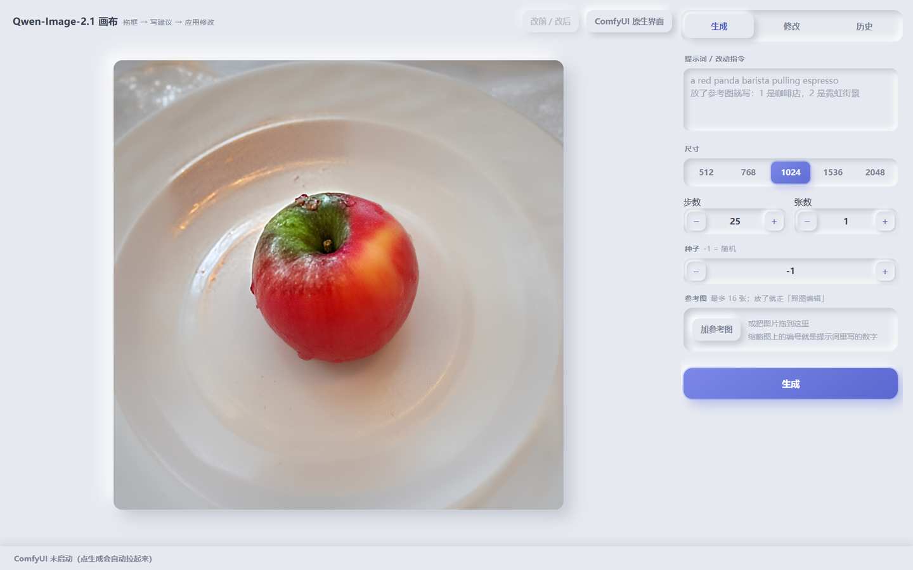
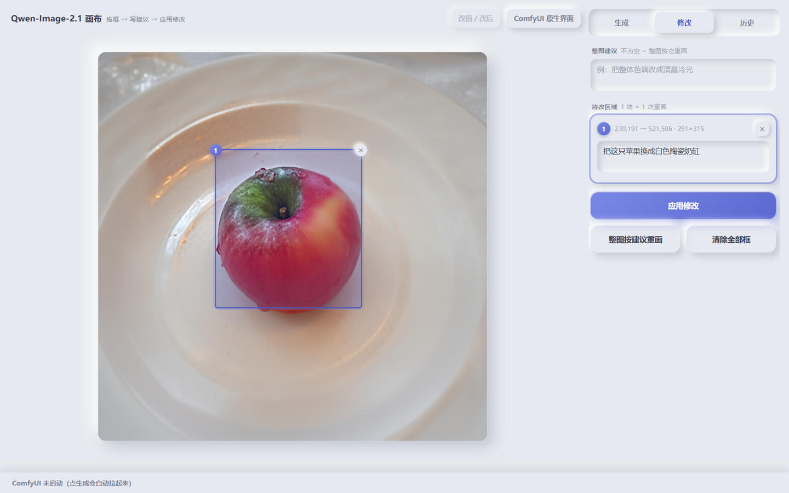

# Qwen 画布（Qwen-canvas）

本地出图模型的一个**画布面板**：填参数出图 → 在图上拖一个方框、写一句改动建议 → **只重画框里那一块** →
点一张历史图当新底图继续迭代。单文件前端、零构建、零 CDN，服务端是 stdlib + Pillow 的一层壳。

**它自己不跑模型**：出图的还是 ComfyUI（读它的 `output\`、写它的 `input\`，HTTP `:8188`）。
面板与 ComfyUI 之间只有两个接触点：**ComfyUI 的根目录**和**它的端口** —— 所以面板可以单独放、单独搬、
指向任何一份同机的 ComfyUI。

> A neumorphic canvas WebUI for a local ComfyUI model: text-to-image, *drag a box + write an instruction → only that
> region is repainted*, history grid for iterate-on-a-previous-image. Single-file frontend, no build step, no CDN.
> Decoupled from ComfyUI: the only contact points are its root directory and its HTTP port.





## 是什么 / 不是什么

- **是** ComfyUI HTTP API 的一层壳：图仍然落在 ComfyUI 的 `output\`，显存是同一个服务进程；面板只管 UI、拼图、
  造蒙版、落盘。
- **不是** 独立推理后端：不 `import` ComfyUI 的任何东西、不用它的 venv、不假设它就在隔壁。
- 只在**同一台机器**上成立（要直接读写 ComfyUI 的 `output\` / `input\`）。跨机器要另做走 `/view`、`/upload` 的版本。
- 单用户、本机 `127.0.0.1` 工具，没有账号体系，**不要往公网暴露**（它能删 `output\` 里的图）。

## 快速开始（Windows）

前提：一份能出图的 ComfyUI（自带 `.venv` 与 `main.py`），以及 Python 3.12 / 3.13。

```bat
git clone https://github.com/Offblink/Qwen-canvas && cd Qwen-canvas

REM 1) 指向你的 ComfyUI：拷一份配置样例，改成实际路径（相对路径按面板目录解析）
copy canvas.json.example canvas.json
REM    { "comfy_root": "D:/ComfyUI", "comfy_autostart": true }

REM 2) 建面板自己的 venv（Pillow + aiohttp，约 35 MB，不含 torch）
powershell -NoProfile -ExecutionPolicy Bypass -File qwen_setup.ps1

REM 3) 起面板并开浏览器
打开画布.cmd
```

面板起来后是 `http://127.0.0.1:8189`。`打开画布.cmd -NoBrowser` 只起服务不开浏览器；
停面板用 `powershell -File qwen_canvas.ps1 -Stop`（只杀面板进程，**不碰 ComfyUI**）。

> ComfyUI 的起停不归面板：点「生成」时面板按 `canvas.json` 把 ComfyUI 拉起来（分离进程、stdout 重定向到
> `<comfy_root>\qwen_server.log`）；**停 ComfyUI 是模型侧自己的事**。`comfy_autostart: false` 时面板只当前端，
> 绝不自己拉服务。

入口脚本是 PowerShell（Windows）。服务端本身是纯 Python：`python qwen_canvas.py` 在 macOS / Linux 上同样能跑，
缺的只是那两个 `.cmd/.ps1` 包装。

## 配置：`canvas.json` / 环境变量

优先级 **环境变量 `QWEN_<KEY>` > 同目录 `canvas.json` > 默认值**；相对路径按**面板目录**解析，不按 `cwd`。

| canvas.json | 环境变量 | 默认 | 作用 |
|---|---|---|---|
| `comfy_root` | `QWEN_COMFY_ROOT` | `<面板>\ComfyUI` | ComfyUI 根目录 |
| `output_dir` | `QWEN_OUTPUT_DIR` | `<comfy_root>\output` | 历史图 / 底图来源 |
| `input_dir` | `QWEN_INPUT_DIR` | `<comfy_root>\input` | 底图 / 蒙版 / 参考图中转 |
| `comfy_python` | `QWEN_COMFY_PYTHON` | `<comfy_root>\.venv\Scripts\python.exe` | 拉起 ComfyUI 用的解释器 |
| `comfy_log` | `QWEN_COMFY_LOG` | `<comfy_root>\qwen_server.log` | 拉起时它的 stdout |
| `comfy_cmd` | — | `["main.py","--listen","127.0.0.1","--port",<comfy_port>]` | 相对 `comfy_root` 执行 |
| `comfy_autostart` | `QWEN_COMFY_AUTOSTART` | `true` | `false` = 绝不自己拉服务 |
| — | `QWEN_CANVAS_PORT` | `8189` | 面板端口 |
| — | `QWEN_COMFY_PORT` | `8188` | ComfyUI 端口 |
| — | `QWEN_INPUT_KEEP` | `24` | `input\` 里 `base_`/`mask_` 中转件保留个数 |
| — | `QWEN_INPUT_REF_TTL_HOURS` | `168` | `input\` 里 `ref_` 参考图的保留时长 |

`canvas.json` 在 `.gitignore` 里（本机配置），仓库里提交的是 `canvas.json.example`。

## 界面

新拟态（浅灰底 + 双向柔和阴影）、**零原生控件**：左边常驻画布，右边三个页签，底部状态栏。
所有控件自绘（`appearance:none`）、滚动条自绘、连删图确认框都是自绘的（Esc / 点背景 = 取消，Enter = 确定）。

| 页签 | 内容 |
|---|---|
| **生成** | 提示词 / 尺寸（512·768·1024·1536·2048）/ 步数 / 张数 / 种子（− 值 + 步进器）/ 参考图 / 生成 |
| **修改** | 整图建议 → 待改区域卡片 → **列表最下方的「应用修改」**，其下「整图按建议重画」「清除全部框」；改完顶部「改前 / 改后」亮起 |
| **历史** | 最近生成的网格（48 张以内），点一张换底图继续迭代（**留在历史页不跳转**）；悬停格子右上角出现 `×`，确认后从 `output\` 删掉 |

| 操作 | 效果 |
|---|---|
| 在图上按住左键**拖一个方框** | 出现「区域 N」（图上编号徽标 + `×`），自动跳到「修改」页并聚焦该块的建议框 |
| 卡片里写一句改动建议 | 例：`把这只苹果换成白色陶瓷奶缸` |
| **应用修改** | **逐块串行**重画，只改框内，每块一次采样 |
| **整图按建议重画** | 不框区域，整图按建议重画（等价参考图编辑） |
| **ComfyUI 原生界面**（右上角） | `POST /api/start` 之后另开官方 UI（`:8188`） |
| 改前 / 改后 | 叠一张「改前」在画布上，`clip-path` 拖动分割，中缝可拖、两端 <15%/>85% 吸附 |

参考图缩略图带 **1 / 2 / 3 编号徽标**，点徽标把编号插进当前聚焦的输入框；提示词里**直接写裸数字**（`1` = 第 1 张），
**服务端不做翻译**（开关是 `qwen_canvas.html` 里的 `REF_BARE`）。

## HTTP 接口

| 方法 | 路径 | 说明 |
|---|---|---|
| GET | `/api/state` | ComfyUI 在线？+ `autostart` + 最近图清单 |
| GET | `/api/status` | 队列状态 + **真实采样步数** `step/steps`（拿不到就 null，前端转圈、不编百分比） |
| POST | `/api/start` | 按配置拉起 ComfyUI |
| POST | `/api/generate` | 文生图 / 参考图编辑 |
| POST | `/api/local` | 局部重画；`regions` 为空 = 整图重画 |
| POST | `/api/upload` | 参考图（data URL） |
| POST | `/api/delete` | `{name}` 删 `output\` 里的一张图（只认裸文件名 + `.png`，`..`、子路径、非 png 一律 404） |
| GET | `/img?name=&dir=` | 取图 |
| GET | `/vendor/<name>.js` | 本地内置的前端库（只认 `vendor\` 下的 `.js` 裸文件名） |

改 `.html` 不用重启服务（每次请求从磁盘读）；改 `.py` 要重启：`qwen_canvas.ps1 -Stop` → 等 `netstat` 确认 8189 没在
LISTEN → 再起（不等端口释放就起，新进程会因端口占用直接退出）。

## 局部重画是怎么做的

1. 面板按**底图原始尺寸**用 PIL 画一张蒙版：**白 = 重画**，黑 = 保持。
2. **模型看不到框**，它只读 conditioning 里的文字；面板自动把建议包成
   `只修改 <image1> 里被框选的那一块区域：<建议>。框外的画面必须保持原样，不要改动。`
3. 多块时**每块单独一张蒙版、单独一次采样**（`VAEEncode` + `SetLatentNoiseMask`，`denoise=1.0`）；每块出图后把它拷回
   `input\` 当下一块的底图（尺寸不变，所以框选坐标继续有效）。框外像素会有 1–2 的 VAE 往返噪声，不是 0，正常。
4. 中转文件会清：每次 POST 前 `prune_input()`，`base_`/`mask_` 只留最新 24 个，`ref_` 只删超过 7 天的
   （按个数删会让页面里还引用着的参考图 LoadImage 失败），其它文件永不触碰。

## 动效（4 处，全部本机内置）

形式取自 `Offblink/Gasp-Design`（GSAP 3.12.7 + Flip），但**不引 CDN**：`vendor/gsap.min.js`（72 KB）+
`vendor/Flip.min.js`（25 KB）跟着仓库走，由 `/vendor/<name>.js` 提供。

| 动效 | 实现 |
|---|---|
| 改前/改后对比 | `clip-path: inset(0 X% 0 0)` 拖动分割，中缝可拖、两端吸附；用 pointer 事件（没引 Draggable） |
| 运行态进度环 + 数字递增 | 状态栏的环按 `/api/status` 的**真实采样步数**填；拿不到就转圈；秒数滚到终值 |
| 新图落盘像素化 | 叠一层 `<canvas>`，按马赛克块边长 26px → 1px 重画当前图再淡出（复刻 three.js 版的 `pixelation-transition`，不引 three.js） |
| 删卡片 / 删历史后补位 | GSAP Flip：`getState` → 重建 DOM → `Flip.from(state, {targets: 新节点})`；新节点 `onEnter` + stagger 入场 |

拿不到 GSAP 或用户开了 `prefers-reduced-motion` 时，所有动效直接落终态，功能不受影响。

两个踩过的坑（都已修，改这部分前必读）：

- **Flip 必须显式传 `targets`**：面板每次 `innerHTML=''` 重建 DOM，不传 `targets` 它动的是已经脱离文档的隐形旧节点，
  屏幕上的新节点纹丝不动。
- **隐藏容器里不能量尺寸、更不能把量到的 0 写回 DOM**：在隐藏页签里渲染（`!host.offsetParent`）时 `getState()` 量到
  宽高 0，Flip 会把 `width:0` 当目标尺寸内联写回新节点，整格塌成 0×0（图看不见、`×` 也点不到）。修法是宿主没布局
  尺寸就只改 DOM 不做动画 + 收尾 `clearProps`。**验收必须量 `getBoundingClientRect()`**，只数 DOM 数量查不出来。

## 悬停 / 焦点

新拟态里「悬停」= 阴影变深（抬起来）、「按下」= 阴影翻成 inset（按进去），全站这一条：

- 过渡统一挂在 `button` 基类上；单给某个按钮写 `transition` 会盖掉基类（特异性更高），别再写。
- 悬浮按钮悬停把阴影从 5–8px 加到 6–10px；凹陷槽里的按钮（页签、分段）悬停"顶起来"，`.on` 态走"变亮"不下沉。
- **`:hover` 规则必须写在 `:active` 之前**（同特异性，后写的赢）。
- `.cell` / `.reg` 是 Flip 的 targets，悬停规则里**不能加 `transform`**（会和 GSAP 的内联 transform 打架）；
  要放大只能加在没被 Flip 动的后代上。
- `button{outline:none}` 必须配 `button:focus-visible{outline:2px solid var(--accent)}`，否则 Tab 走一圈什么都看不见。
- 悬停不改布局（只动 box-shadow / color / background / filter）。

## 实测（2026-09-21，RTX 5070 Ti Laptop 12 GB，模型 Qwen-Image-2.1，1024²/25 步为默认）

| 项 | 数字 |
|---|---|
| 文生图 | 768²/8 步 **7.3 s**、768²/12 步 8.3 s；1024²/25 步 13–26 s |
| 参考图编辑 | 35–40 s |
| 局部重画（每块） | 1024²/25 步 27–37 s；768²/8 步 **9.1 s** |
| 冷启 ComfyUI（`/api/start`，含加载权重） | ~10 s |
| 采样进度 | `/api/status` 采到真实 `step 2→12 / 12`，跑完复位 `0/0` |
| 面板 venv | Pillow 12.3.0 + aiohttp 3.14.3，35 MB（无 torch） |

## 目录

```
├── 打开画布.cmd / qwen_canvas.ps1   起面板 + 开浏览器（-NoBrowser 只起；-Stop 只停面板）
├── qwen_setup.ps1                   建/补面板自己的 .venv（Pillow + aiohttp）
├── canvas.json.example              配置样例（拷成 canvas.json）
├── qwen_canvas.py                   面板服务（stdlib + Pillow；aiohttp 可选）
├── qwen_canvas.html                 面板前端（单文件、无框架、无构建）
├── vendor/                          gsap.min.js + Flip.min.js（本机内置，不连 CDN）
├── docs/                            README 截图
└── CANVAS_NOTES.md                  面板口径：接口、动效坑、悬停规则、清理策略（**改动前先读这份**）
```

## 已知边界

- `stop`/`start` 的包装脚本是 PowerShell（Windows）；服务端本身跨平台。
- 面板假设 ComfyUI 与它同机，且 ComfyUI 的 `input\` / `output\` 是它自己的目录。
- 参考图的裸数字写法不做服务端翻译（模型侧实测：裸数字与 `<image1>` 等价）。
- 单用户本机工具：无鉴权、无并发保护，`/api/delete` 能删 `output\` 里的图。

MIT License（见 `LICENSE`）。
